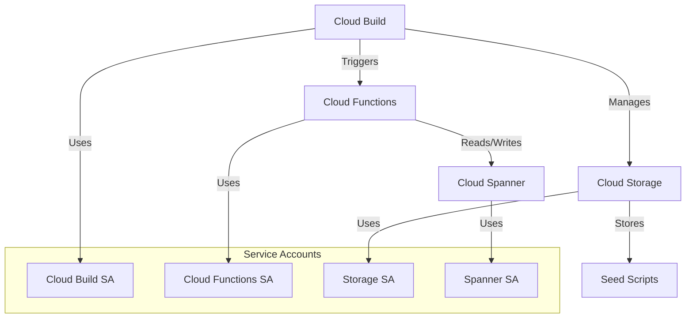

# Google Cloud Service Accounts Setup for Terraform

This document contains all the necessary commands to set up service accounts and IAM permissions for the Terraform infrastructure.

## Architecture Diagram



## 1. Enable Required Google Cloud APIs

Before creating service accounts and resources, you need to enable the required Google Cloud APIs:

```bash
# Enable Cloud Build API
gcloud services enable cloudbuild.googleapis.com

# Enable Cloud Functions API
gcloud services enable cloudfunctions.googleapis.com

# Enable Cloud Storage API
gcloud services enable storage.googleapis.com

# Enable Cloud Spanner API
gcloud services enable spanner.googleapis.com

# Enable IAM API (required for service account management)
gcloud services enable iam.googleapis.com

# Enable Cloud Resource Manager API (required for project-level operations)
gcloud services enable cloudresourcemanager.googleapis.com

# Enable Service Management API
gcloud services enable servicemanagement.googleapis.com

# Enable Service Usage API
gcloud services enable serviceusage.googleapis.com
```

You can verify the enabled APIs using:
```bash
gcloud services list --enabled
```

## 2. Create Service Accounts

```bash
# Create Cloud Build service account
gcloud iam service-accounts create terraform-cloudbuild \
    --display-name="Terraform Cloud Build Service Account"

# Create Cloud Functions service account
gcloud iam service-accounts create terraform-cloudfunctions \
    --display-name="Terraform Cloud Functions Service Account"

# Create Storage service account
gcloud iam service-accounts create terraform-storage \
    --display-name="Terraform Storage Service Account"

# Create Spanner service account (if not already created)
gcloud iam service-accounts create terraform-spanner \
    --display-name="Terraform Spanner Service Account"
```

## 2. Grant IAM Roles to Service Accounts

### Cloud Build Service Account Permissions
```bash
# Basic Cloud Build permissions
gcloud projects add-iam-policy-binding p77133-py-bigquery-cloud-run \
    --member="serviceAccount:terraform-cloudbuild@p77133-py-bigquery-cloud-run.iam.gserviceaccount.com" \
    --role="roles/cloudbuild.builds.builder"

# Additional permissions for Cloud Build to access other services
gcloud projects add-iam-policy-binding p77133-py-bigquery-cloud-run \
    --member="serviceAccount:terraform-cloudbuild@p77133-py-bigquery-cloud-run.iam.gserviceaccount.com" \
    --role="roles/storage.admin"

gcloud projects add-iam-policy-binding p77133-py-bigquery-cloud-run \
    --member="serviceAccount:terraform-cloudbuild@p77133-py-bigquery-cloud-run.iam.gserviceaccount.com" \
    --role="roles/cloudfunctions.developer"

# Required permissions for Cloud Build to manage builds and service accounts
gcloud projects add-iam-policy-binding p77133-py-bigquery-cloud-run \
    --member="serviceAccount:terraform-cloudbuild@p77133-py-bigquery-cloud-run.iam.gserviceaccount.com" \
    --role="roles/cloudbuild.builds.editor"

gcloud projects add-iam-policy-binding p77133-py-bigquery-cloud-run \
    --member="serviceAccount:terraform-cloudbuild@p77133-py-bigquery-cloud-run.iam.gserviceaccount.com" \
    --role="roles/iam.serviceAccountUser"
```

### Cloud Functions Service Account Permissions
```bash
# Basic Cloud Functions permissions
gcloud projects add-iam-policy-binding p77133-py-bigquery-cloud-run \
    --member="serviceAccount:terraform-cloudfunctions@p77133-py-bigquery-cloud-run.iam.gserviceaccount.com" \
    --role="roles/cloudfunctions.developer"

# Spanner access for Cloud Functions
gcloud projects add-iam-policy-binding p77133-py-bigquery-cloud-run \
    --member="serviceAccount:terraform-cloudfunctions@p77133-py-bigquery-cloud-run.iam.gserviceaccount.com" \
    --role="roles/spanner.databaseUser"

# Storage access for Cloud Functions
gcloud projects add-iam-policy-binding p77133-py-bigquery-cloud-run \
    --member="serviceAccount:terraform-cloudfunctions@p77133-py-bigquery-cloud-run.iam.gserviceaccount.com" \
    --role="roles/storage.objectViewer"
```

### Storage Service Account Permissions
```bash
# Full storage permissions
gcloud projects add-iam-policy-binding p77133-py-bigquery-cloud-run \
    --member="serviceAccount:terraform-storage@p77133-py-bigquery-cloud-run.iam.gserviceaccount.com" \
    --role="roles/storage.admin"
```

### Spanner Service Account Permissions
```bash
# Spanner admin permissions
gcloud projects add-iam-policy-binding p77133-py-bigquery-cloud-run \
    --member="serviceAccount:terraform-spanner@p77133-py-bigquery-cloud-run.iam.gserviceaccount.com" \
    --role="roles/spanner.admin"

# Additional required permissions for Spanner service account
gcloud projects add-iam-policy-binding p77133-py-bigquery-cloud-run \
    --member="serviceAccount:terraform-spanner@p77133-py-bigquery-cloud-run.iam.gserviceaccount.com" \
    --role="roles/storage.admin"

# Required for Cloud Build trigger
gcloud projects add-iam-policy-binding p77133-py-bigquery-cloud-run \
    --member="serviceAccount:terraform-spanner@p77133-py-bigquery-cloud-run.iam.gserviceaccount.com" \
    --role="roles/cloudbuild.builds.editor"
```

### Cloud Functions Service Account Additional Permissions
```bash
# Required for creating and managing Cloud Functions
gcloud projects add-iam-policy-binding p77133-py-bigquery-cloud-run \
    --member="serviceAccount:terraform-cloudfunctions@p77133-py-bigquery-cloud-run.iam.gserviceaccount.com" \
    --role="roles/cloudfunctions.developer"

# Required for Cloud Functions to access other services
gcloud projects add-iam-policy-binding p77133-py-bigquery-cloud-run \
    --member="serviceAccount:terraform-cloudfunctions@p77133-py-bigquery-cloud-run.iam.gserviceaccount.com" \
    --role="roles/cloudfunctions.serviceAgent"
```

### Cloud Build Service Account Additional Permissions
```bash
# Required for Cloud Build to manage builds
gcloud projects add-iam-policy-binding p77133-py-bigquery-cloud-run \
    --member="serviceAccount:terraform-cloudbuild@p77133-py-bigquery-cloud-run.iam.gserviceaccount.com" \
    --role="roles/cloudbuild.builds.editor"

# Required for Cloud Build to access other services
gcloud projects add-iam-policy-binding p77133-py-bigquery-cloud-run \
    --member="serviceAccount:terraform-cloudbuild@p77133-py-bigquery-cloud-run.iam.gserviceaccount.com" \
    --role="roles/cloudbuild.serviceAgent"

# Required for Cloud Build to create Cloud Functions
gcloud projects add-iam-policy-binding p77133-py-bigquery-cloud-run \
    --member="serviceAccount:terraform-cloudbuild@p77133-py-bigquery-cloud-run.iam.gserviceaccount.com" \
    --role="roles/cloudfunctions.developer"
```

## 3. Create and Download Service Account Keys

```bash
# Create and download keys for each service account
gcloud iam service-accounts keys create ~/.config/gcloud/terraform-cloudbuild-key.json \
    --iam-account=terraform-cloudbuild@p77133-py-bigquery-cloud-run.iam.gserviceaccount.com

gcloud iam service-accounts keys create ~/.config/gcloud/terraform-cloudfunctions-key.json \
    --iam-account=terraform-cloudfunctions@p77133-py-bigquery-cloud-run.iam.gserviceaccount.com

gcloud iam service-accounts keys create ~/.config/gcloud/terraform-storage-key.json \
    --iam-account=terraform-storage@p77133-py-bigquery-cloud-run.iam.gserviceaccount.com

gcloud iam service-accounts keys create ~/.config/gcloud/terraform-spanner-key.json \
    --iam-account=terraform-spanner@p77133-py-bigquery-cloud-run.iam.gserviceaccount.com
```

## 4. Update terraform.tfvars

After creating the service account keys, update your `terraform.tfvars` file with the correct paths:

```hcl
credentials_file = "~/.config/gcloud/terraform-spanner-key.json"
```

## 5. Terraform Outputs

Terraform outputs are defined in `outputs.tf` and provide important information about the created resources. Here's how to use them:

### Viewing Outputs
```bash
# View all outputs after apply
terraform output

# View specific output
terraform output spanner_instance_state
```

### Using Outputs in Other Configurations
Outputs can be referenced in other Terraform configurations using:
```hcl
data "terraform_remote_state" "example" {
  backend = "gcs"
  config = {
    bucket = "your-state-bucket"
    prefix = "path/to/state"
  }
}

# Reference the output
resource "example" "example" {
  spanner_instance = data.terraform_remote_state.example.outputs.spanner_instance_state
}
```

### Saving Plan Output
```bash
# Save plan to file
terraform plan -out=tfplan

# Apply saved plan
terraform apply tfplan
```

## Explanation of Roles

1. **Cloud Build Service Account**:
   - `roles/cloudbuild.builds.builder`: Allows Cloud Build to execute builds
   - `roles/storage.admin`: Allows Cloud Build to access and manage storage buckets
   - `roles/cloudfunctions.developer`: Allows Cloud Build to deploy Cloud Functions
   - `roles/cloudbuild.builds.editor`: Allows Cloud Build to manage builds
   - `roles/iam.serviceAccountUser`: Allows Cloud Build to impersonate service accounts

2. **Cloud Functions Service Account**:
   - `roles/cloudfunctions.developer`: Allows management of Cloud Functions
   - `roles/spanner.databaseUser`: Allows reading/writing to Spanner databases
   - `roles/storage.objectViewer`: Allows reading from Cloud Storage

3. **Storage Service Account**:
   - `roles/storage.admin`: Full control over Cloud Storage resources

4. **Spanner Service Account**:
   - `roles/spanner.admin`: Full control over Spanner resources

## Notes

1. All service account keys are stored in `~/.config/gcloud/` for security
2. Make sure to add these paths to your `.gitignore` file
3. The service accounts follow the principle of least privilege
4. You can verify the roles using:
   ```bash
   gcloud projects get-iam-policy p77133-py-bigquery-cloud-run
   ```
5. Terraform outputs are useful for:
   - Sharing information between different Terraform configurations
   - Getting resource information without manual lookups
   - Creating documentation about your infrastructure
6. Saved plans (`tfplan`) are useful for:
   - Reviewing changes before applying
   - Sharing planned changes with team members
   - Ensuring consistent deployments

## Manual Database Seeding

To manually seed the Spanner database, you can use the following methods:

### 1. Using gcloud CLI
```bash
# First, create a SQL file with your seed data (e.g., seed_data.sql)
cat > seed_data.sql << 'EOL'
INSERT INTO credit_enquiry (
    credit_enquiry_id,
    credit_enquiry_version,
    enquiry_state,
    application_number,
    application_start_time,
    created_time,
    updated_time
) VALUES
    ('test-id-1', '1.0.0', 'NEW', 'APP-001', CURRENT_TIMESTAMP(), CURRENT_TIMESTAMP(), CURRENT_TIMESTAMP()),
    ('test-id-2', '1.0.0', 'IN_PROGRESS', 'APP-002', CURRENT_TIMESTAMP(), CURRENT_TIMESTAMP(), CURRENT_TIMESTAMP());

EOL

# Execute the SQL file using gcloud
gcloud spanner databases execute-sql credit-enquiry-db \
    --instance=credit-enquiry-spanner \
    --sql="$(cat seed_data.sql)"
```

### 2. Using Cloud Shell
1. Open Google Cloud Shell
2. Navigate to your project:
```bash
gcloud config set project p77133-py-bigquery-cloud-run
```
3. Connect to the Spanner database:
```bash
gcloud spanner databases execute-sql credit-enquiry-db \
    --instance=credit-enquiry-spanner \
    --sql="INSERT INTO credit_enquiry (credit_enquiry_id, credit_enquiry_version, enquiry_state, application_number, application_start_time, created_time, updated_time) VALUES ('test-id-1', '1.0.0', 'NEW', 'APP-001', CURRENT_TIMESTAMP(), CURRENT_TIMESTAMP(), CURRENT_TIMESTAMP());"
```

### 3. Using Cloud Console
1. Go to the Google Cloud Console
2. Navigate to Spanner
3. Select your instance: `credit-enquiry-spanner`
4. Select your database: `credit-enquiry-db`
5. Click on "Query"
6. Enter your INSERT statements and click "Run"

### Sample Seed Data
```sql
INSERT INTO credit_enquiry (
    credit_enquiry_id,
    credit_enquiry_version,
    enquiry_state,
    application_number,
    application_start_time,
    created_time,
    updated_time
) VALUES
    ('test-id-1', '1.0.0', 'NEW', 'APP-001', CURRENT_TIMESTAMP(), CURRENT_TIMESTAMP(), CURRENT_TIMESTAMP()),
    ('test-id-2', '1.0.0', 'IN_PROGRESS', 'APP-002', CURRENT_TIMESTAMP(), CURRENT_TIMESTAMP(), CURRENT_TIMESTAMP()),
    ('test-id-3', '1.0.0', 'COMPLETED', 'APP-003', CURRENT_TIMESTAMP(), CURRENT_TIMESTAMP(), CURRENT_TIMESTAMP());
```

### Verifying the Data
```bash
# Query the data to verify it was inserted
gcloud spanner databases execute-sql credit-enquiry-db \
    --instance=credit-enquiry-spanner \
    --sql="SELECT * FROM credit_enquiry;"
```

### Notes
1. Make sure you have the necessary permissions to execute SQL on the Spanner database
2. The `CURRENT_TIMESTAMP()` function will use the current time for timestamp fields
3. You can modify the sample data according to your needs
4. Always verify the data after insertion 